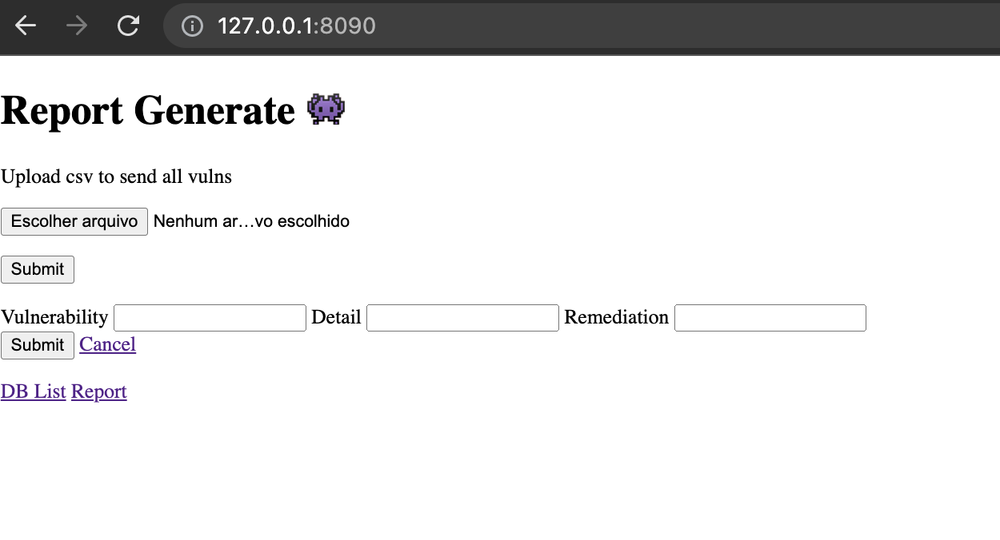
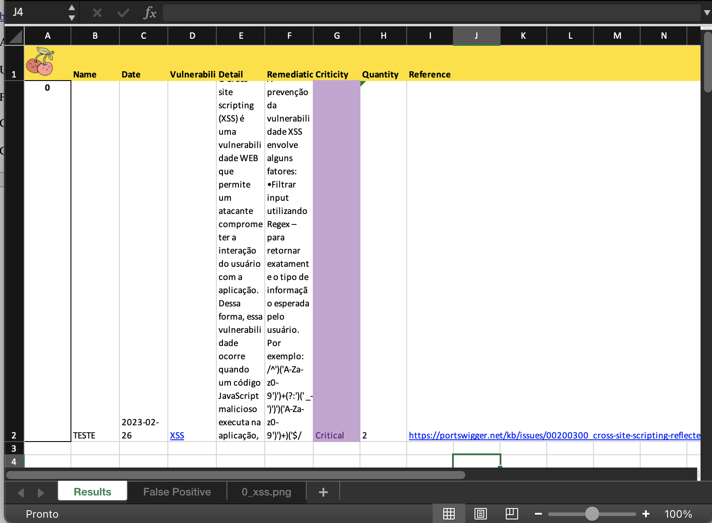

# report-devsecops

## To run
- Install Docker
- To start ```docker-compose up```
- To stop ```docker-compose down```
- To build and change something in code ```docker-compose build```

----
- Web App runs at port 8085

```http://localhost:8090```

----


----
## Excel Genrated!

- Just add your vulnerabilities and check like that on report tab:



Enjoy it 💜
